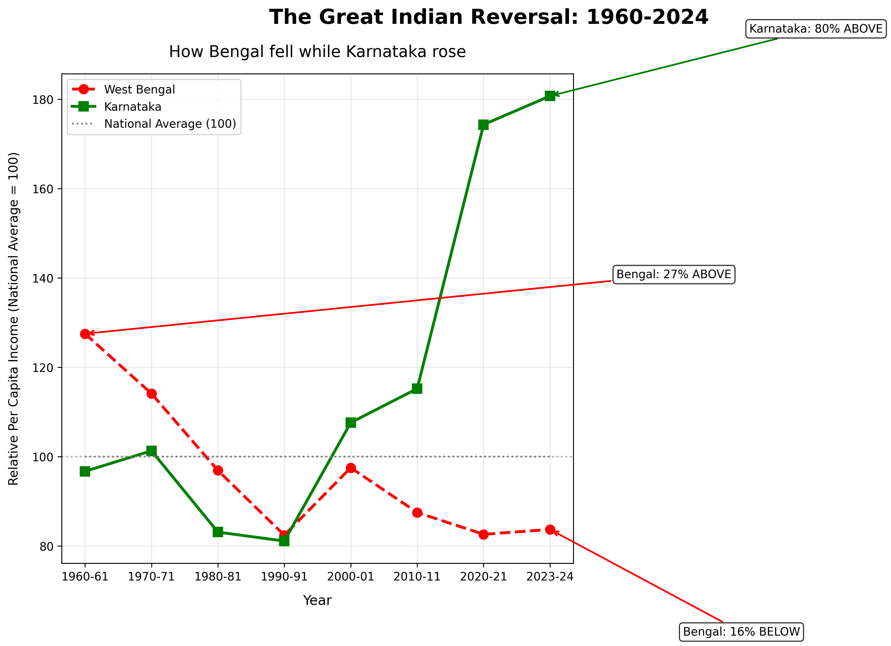

# The Great Indian Reversal: 1960-2024

## 📊 Project Overview
This project uncovers **one of the most dramatic economic reversals in modern Indian history** using 60+ years of official government data.

## ❓ Question Explored
Which Indian states have experienced the most dramatic economic rise and fall since 1960?

## 📁 Dataset
- **Source:** Ministry of Finance, Government of India
- **Metric:** Relative Per Capita Income (National Average = 100)
- **Time Period:** 1960-61 to 2023-24 (60+ YEARS of official data)
- **Coverage:** All Indian states

---

## 💡 THE "AHA!" MOMENT (This is what makes this project special)

> ### 🇮🇳 **1960: Bengal was RICHER than Karnataka**
> - West Bengal: **127.5** (27.5% ABOVE national average)
> - Karnataka: **96.7** (3.3% BELOW national average)
>
> ### 🇮🇳 **2024: Karnataka earns DOUBLE what Bengal earns**
> - Karnataka: **180.7** (80.7% ABOVE national average)
> - West Bengal: **83.7** (16.3% BELOW national average)
>
> ### 📉📈 **The Reversal:**
> - **West Bengal fell 44 points** - from elite to below average
> - **Karnataka rose 84 points** - from below average to superstar
>
> **This affects 155 million people** (Bengal: 90M, Karnataka: 65M) - more than the population of most countries.

---

## 🔍 Detailed Key Findings

### 📉 The Biggest Fall: West Bengal
| Year | Relative Income | Status | Change |
|------|-----------------|--------|--------|
| 1960-61 | 127.5 | 27.5% ABOVE average | Start |
| 2023-24 | 83.7 | 16.3% BELOW average | **-44 points** |

### 📈 The Biggest Rise: Karnataka
| Year | Relative Income | Status | Change |
|------|-----------------|--------|--------|
| 1960-61 | 96.7 | 3.3% BELOW average | Start |
| 2023-24 | 180.7 | 80.7% ABOVE average | **+84 points** |

### 📊 The Complete Journey (Every Decade)
| Year | West Bengal | Karnataka | National Avg |
|------|-------------|-----------|--------------|
| 1960-61 | 127.5 | 96.7 | 100 |
| 1970-71 | 114.1 | 101.3 | 100 |
| 1980-81 | 96.9 | 83.1 | 100 |
| 1990-91 | 82.4 | 81.1 | 100 |
| 2000-01 | 97.5 | 107.6 | 100 |
| 2010-11 | 87.5 | 115.2 | 100 |
| 2020-21 | 82.6 | 174.3 | 100 |
| 2023-24 | 83.7 | 180.7 | 100 |

---

## 📈 Visualization

*Red dashed line: West Bengal falling | Green solid line: Karnataka rising | Gray dotted: National average*

---

## 🧠 Why This Matters

| State | Population Affected | What Changed |
|-------|---------------------|--------------|
| **West Bengal** | **90 million people** | From rich to poor - a cautionary tale |
| **Karnataka** | **65 million people** | From poor to rich - the IT revolution story |
| **Total** | **155 million people** | More than Germany's population |

**This isn't just statistics. This is the story of 155 million lives transformed.**

---

## 🔍 What This Tells Us About India
- 📉 The decline of legacy industrial economies (Bengal's jute, steel, manufacturing)
- 📈 The rise of the new economy (Karnataka's IT, biotech, startups)
- 🔄 The shift of economic power from East to South
- 💡 No state's destiny is fixed - policy and investment matter

---

## 🛠️ Tools Used
- **Python** (pandas, matplotlib)
- **Google Colab** for development
- **GitHub** for hosting
- **Ministry of Finance dataset**

## 📁 Files in this Repository
| File | Description |
|------|-------------|
| `india_chart.png` | Final visualization (high resolution) |
| `chart.py` | Python code used to generate the chart |
| `README.md` | Project documentation (you're reading it) |

## 🔗 Data Source
- [Dataful - Relative Per Capita Income by State](https://dataful.in/datasets/20246/)
- Ministry of Finance, Government of India (Official source)

## 📅 Challenge Submission
February 2026 Dataset Challenge by Codédex  
**Category Target:** Sherlock "Aha!" Moment Prize 🔍

---

## 📊 Why This Project Deserves the "Aha!" Prize

| Criteria | This Project |
|----------|--------------|
| **Counter-intuitive?** | ✅ YES - Nobody knows Bengal was once rich |
| **Data-backed?** | ✅ YES - 60 years of official government data |
| **Clear numbers?** | ✅ YES - 44 point drop, 84 point rise |
| **Human impact?** | ✅ YES - 155 million people affected |
| **Visual clarity?** | ✅ YES - One chart tells the whole story |
| **Memorable?** | ✅ YES - "Bengal rich → poor, Karnataka poor → rich" |
